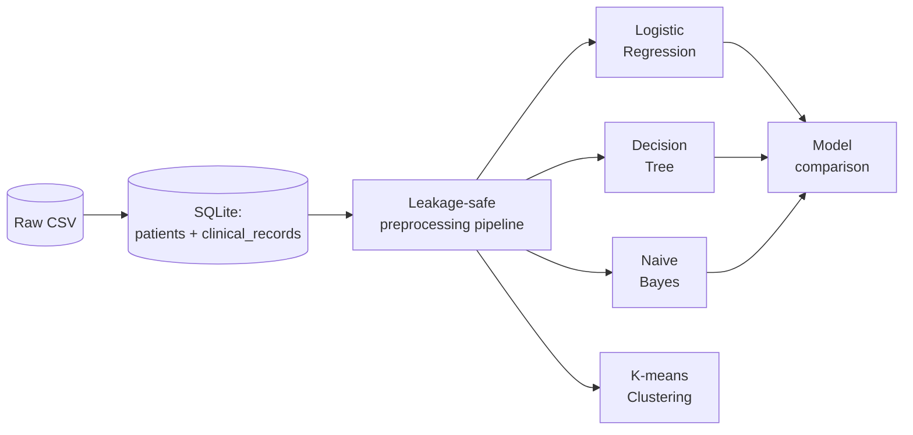
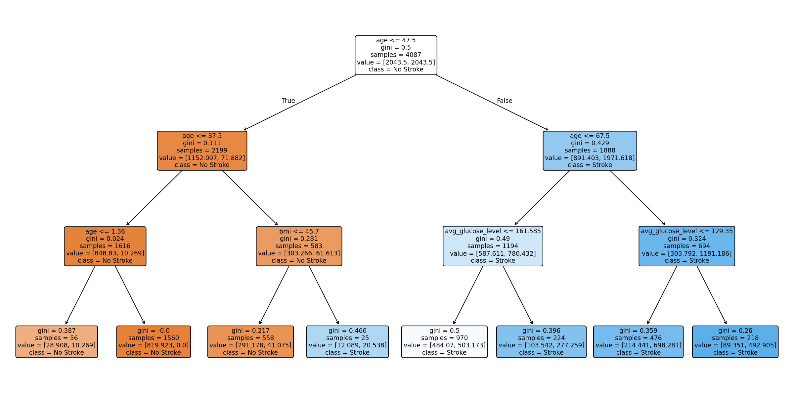
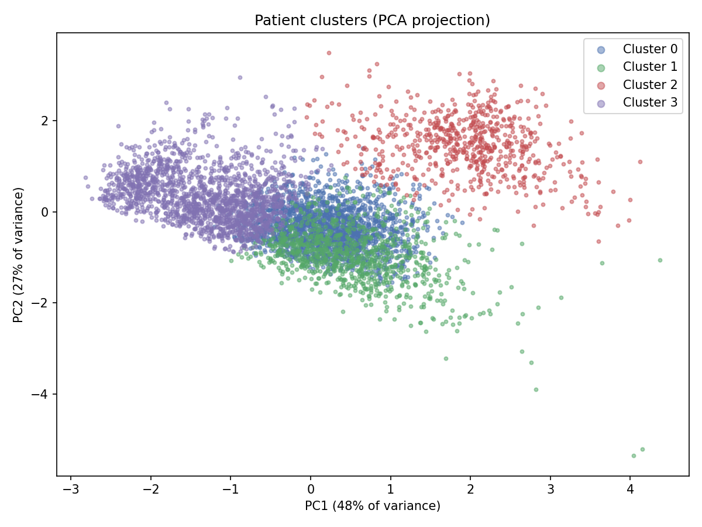

# Stroke Risk Analytics

**A comparative machine learning engineering case study: four modeling paradigms, one shared leakage-safe pipeline, applied to a public clinical dataset.**

[](https://github.com/spearslogan36/stroke-risk-analytics/actions/workflows/tests.yml)

## What this project actually is

This is **not** a clinical tool, and it doesn't discover anything new about stroke risk. It's a 5,110-row public dataset ([Kaggle, fedesoriano](https://www.kaggle.com/datasets/fedesoriano/stroke-prediction-dataset)), and its findings (age, hypertension, and glucose predict stroke risk) are already well established in medicine. What this project actually demonstrates is the following: a leakage-safe data pipeline, a comparison across fundamentally different modeling approaches, and the process of catching and correctly fixing bugs. This started as an assignment for showcasing logistic regression, however I wanted to extend this project to show the process of fixing the bugs found in the beginning to the point where adding the three additional models requires no changes to the base data layer (SQL schema, leakage-safe pipeline, test suite).

## Two things this project demonstrates

**1. Four fundamentally different modeling paradigms, compared fairly.** This uses a linear parametric model (logistic regression), a non-parametric rule-based model (decision tree), a generative probabilistic model (Naive Bayes), and an unsupervised method (K-means clustering). Every model's core assumption gets checked rather than assumed. Naive Bayes' independence assumption is tested directly against the data's own correlation matrix before the model is trusted. The tree's depth is tuned against overfitting via cross-validation. K-means' cluster count is chosen with a silhouette score. Class imbalance is handled a different, model-appropriate way for each: `class_weight="balanced"` for the linear and tree models, a native prior override for Naive Bayes, and no rebalancing at all for clustering, since it never used the label in the first place.

**2. Real methodology bugs caught and fixed** Working on this project revealed three leakage issues: a missing-value imputation computed on the full dataset instead of training data only, a rare-category handling decision made by inspecting outcome rates across the *entire* dataset before splitting, and a classification threshold selected by testing directly against the test set. All three are fixed here — not patched over, but fixed at the architectural level (a `ColumnTransformer`/`Pipeline` that makes the imputation mistake structurally hard to repeat; Firth's penalized logistic regression instead of a target-informed category merge; out-of-fold threshold selection via `cross_val_predict` instead of test-set peeking). See [Data leakage: what was wrong, and how it's fixed](#data-leakage-what-was-wrong-and-how-its-fixed) below.

## Data flow



## Results

### Supervised model comparison

Same train/test split, same leakage-safe pipeline, each model's class-balanced variant evaluated at the default 0.5 threshold:

| Model | Accuracy | Precision | Recall | F1 | ROC-AUC |
|---|---|---|---|---|---|
| **Logistic Regression** | 0.726 | 0.129 | 0.80 | 0.222 | **0.839** |
| Decision Tree | 0.568 | 0.088 | 0.84 | 0.160 | 0.820 |
| Naive Bayes | 0.560 | 0.087 | 0.84 | 0.157 | 0.797 |

Logistic regression wins on every metric. All three were independently tuned to prioritize catching stroke cases (hence similar recall). See each model's own script for the reasoning specific to why it under- or over-performed.

### Interpretability: the decision tree



Unscaled splits deliberately kept in original clinical units (`age <= 47.5`, not `age <= 0.19`).

### Statistical inference: what's actually significant

Fit with Firth's penalized logistic regression specifically so the rare `Never_worked` category (n=22, zero stroke events) could be estimated honestly rather than merged away or excluded:

| Predictor | Odds Ratio | p-value |
|---|---|---|
| Age (per 1 SD ≈ 22.6 yrs) | 5.16 | < 0.001 |
| Hypertension | 1.67 | 0.004 |
| Avg. glucose level (per 1 SD) | 1.20 | 0.002 |
| `work_type = Never_worked` | 10.57 (95% CI: 0.58–193.9) | 0.112 (not significant) |

That last row is deliberately included. A wide confidence interval from a 22-patient category is the model being honest about what it doesn't know.

### Unsupervised: patient risk segments



K-means (K=4, chosen via silhouette score) clustered patients using only age, glucose, BMI, hypertension, and heart disease. The stroke label was never used to form these groups. Stroke rate per cluster, computed only afterward as a validation check:

| Cluster | Age | Glucose | Hypertension | Heart Disease | **Stroke Rate** |
|---|---|---|---|---|---|
| Children & young adults | 18.0 | 92.7 | 0.5% | 0.2% | **0.2%** |
| Younger adults, higher BMI | 41.5 | 90.5 | 9.7% | 2.1% | **1.6%** |
| Older adults, lower comorbidity | 60.1 | 89.6 | 12.1% | 8.0% | **7.5%** |
| Older adults, high comorbidity | 60.7 | 207.7 | 26.0% | 15.6% | **13.4%** |

A 67× spread in real stroke rate, from groups formed with zero knowledge of who actually had a stroke.

## Data leakage: what was wrong, and how it's fixed

| Issue | Root cause | Fix |
|---|---|---|
| BMI imputation | Median computed on the full dataset before the train/test split | `SimpleImputer` inside a `Pipeline`, fit on training data only |
| `work_type` category handling | Decision to merge a rare category made by inspecting stroke rates across the *entire* dataset | Firth's penalized logistic regression — no category decision informed by outcome data needed at all |
| Decision threshold selection | Chosen by maximizing F1 directly against the test set | Selected from out-of-fold predictions (`cross_val_predict`) on training data only; test set touched exactly once at the end |

## Running this project locally

```bash
git clone https://github.com/spearslogan36/stroke-risk-analytics.git
cd stroke-risk-analytics
pip install -r requirements-dev.txt
python src/build_database.py
python src/train_logistic.py
python src/train_inferential.py
python src/train_decision_tree.py
python src/train_naive_bayes.py
python src/cluster_patients.py
python src/compare_models.py
pytest
```

## Limitations

- **Small positive class.** 249 stroke cases total (50 in the test set) — subgroup estimates carry real uncertainty, made explicit rather than hidden (see the `Never_worked` result above).
- **Observational, cross-sectional data.** These are associations, not causal claims — no treatment or timeline data exists to support stronger language.
- **Single dataset, no external validation.** Findings replicate known clinical relationships; they haven't been tested against a second, independent population.

## Tech stack

Python · pandas · scikit-learn · statsmodels · firthmodels · SQLite · pytest · GitHub Actions
